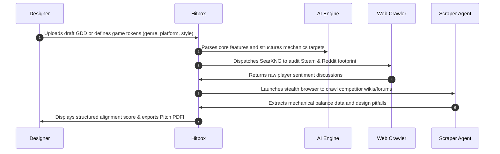

# 🎯 Hitbox AI
### *Stop Guessing. Validate Your Game Design Before You Code.*

  <svg width="600" height="200" viewBox="0 0 600 200" fill="none" xmlns="http://www.w3.org/2000/svg">
    <rect width="600" height="200" rx="16" fill="#0A0A0C" />
    <rect x="1" y="1" width="598" height="198" rx="15" stroke="#1F1F24" stroke-width="2" />
    
    <!-- Title -->
    <text x="50%" y="75" text-anchor="middle" fill="#FFFFFF" font-family="system-ui, sans-serif" font-weight="800" font-size="40" letter-spacing="2">HITBOX AI</text>
    <text x="50%" y="110" text-anchor="middle" fill="#8E9196" font-family="system-ui, sans-serif" font-size="14" font-weight="400">The Ultimate Game Design Validation & Sentiment Dossier Engine</text>
    
    <!-- Badges -->
    <rect x="90" y="140" width="115" height="26" rx="13" fill="#EF4444" fill-opacity="0.1" stroke="#EF4444" stroke-width="1" />
    <text x="147.5" y="157" text-anchor="middle" fill="#EF4444" font-family="system-ui, sans-serif" font-weight="600" font-size="11">Target Audience</text>

    <rect x="220" y="140" width="160" height="26" rx="13" fill="#3B82F6" fill-opacity="0.1" stroke="#3B82F6" stroke-width="1" />
    <text x="300" y="157" text-anchor="middle" fill="#3B82F6" font-family="system-ui, sans-serif" font-weight="600" font-size="11">Reddit & Steam Crawler</text>

    <rect x="395" y="140" width="115" height="26" rx="13" fill="#10B981" fill-opacity="0.1" stroke="#10B981" stroke-width="1" />
    <text x="452.5" y="157" text-anchor="middle" fill="#10B981" font-family="system-ui, sans-serif" font-weight="600" font-size="11">Gemini AI Intel</text>
  </svg>

---

## 💡 The Hard Truth About Game Development

Over **60% of indie games fail** not because of bad code, but because of **poor market fit**. Developers spend thousands of hours building gameplay mechanics only to discover players find them tedious, overdone, or frustrating.

Traditionally, finding out what players think meant hours digging through Reddit, Steam reviews, and competitor forums. 

**Hitbox AI changes that in seconds.**

---

## ✨ What is Hitbox AI?

Hitbox AI is an **intelligent, autonomous game design evaluation suite**. It maps your game's design parameters and dispatches data agents to extract real player feedback and competitor mechanics—giving you a structured, data-backed feasibility dossier before you write a single line of code.

### 🚀 Key Features

* **📄 Instant Blueprint Extraction:** Drop your messy game design notes, drafts, or markdown files into Hitbox. Our AI extracts core parameters and builds your baseline GDD profile automatically.
* **🔍 Live Sentiment Auditing:** Automatically scan Reddit and Steam community forums using SearXNG. Measure exactly how players align with your target concept with a **0-100 Viability Rating**.
* **🕵️‍♂️ Stealth Competitor Scraper:** Dispatch a remote automated agent powered by **Stagehand & Browserbase** to crawl target competitor community pages, extracting their balance models, pitfalls, and player gripes.
* **📊 Visual Telemetry Dashboard:** Track gameplay viability distributions, agent activities, and feedback metrics in real-time.
* **🖨️ Pitch-Ready PDF Export:** Export a beautifully compiled, professional Game Design Document & Pitch Deck PDF to present to publishers, investors, or your team.

---

## 🛠️ How It Works (For Game Designers)

---

## 📈 Leverage Real Insights

* **Identify Pitfalls Early:** Catch mechanical bugs, balancing nightmares, and narrative clichés mentioned by real gamers.
* **Align with Players:** Uncover unmet player desires in your genre.
* **Validate the Market:** Build pitch decks backed by community telemetry, not guesswork.

---

## 🎮 Get Started Now

Ready to validate your next masterpiece?
* Run the app locally in development mode: `npm run dev`
* Build the app for production: `npm run build`
* Deploy to the web for free on **Vercel** with **Hugging Face** hosting.

---

  Made for Game Designers, by Indie Devs. 🚀

